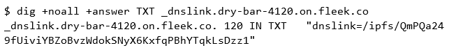
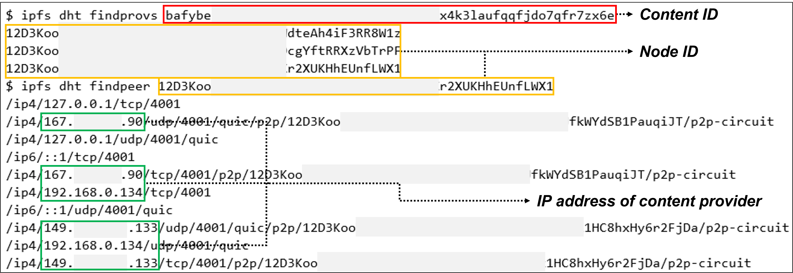
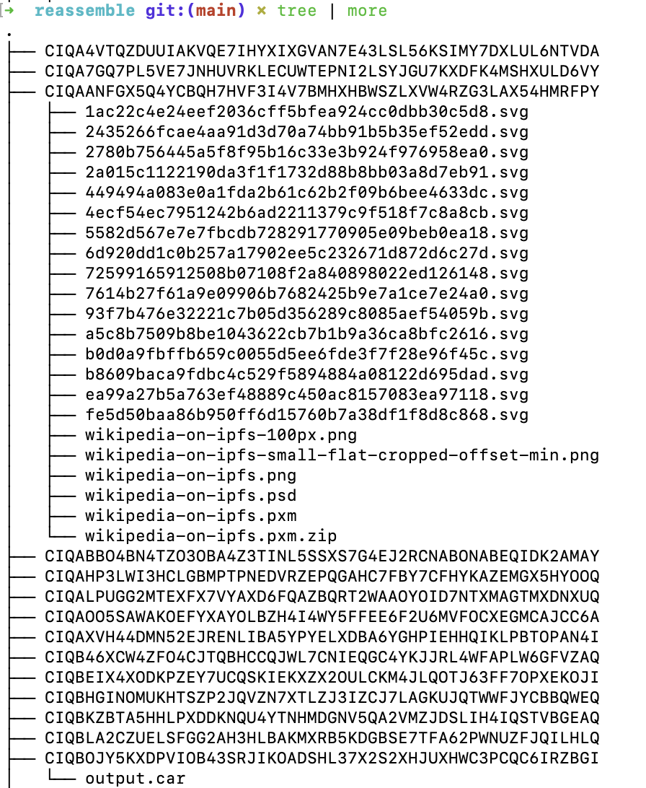

# IF-DSS: forensic Investigation Framework of Decentralized Storage Services

***Congratulations! This project has been accepted to DFRWS APAC 2023 and Forensic Science International: Digital Investigation*** 

We propose a novel forensic investigation framework for DSS, named IF-DSS, as depicted in Figure 2. The framework comprises detailed steps that are categorized into remote and local investigations, depending on the location where potential digital evidence may be stored. Building upon the traditional digital forensic framework, our IF-DSS framework incorporates the necessary steps for effectively responding to DSS, including (1) identification and preparation, (2) collection and preservation, (3) examination and analysis, and (4) prevention.


# Implementation and Dataset

## Implementation

```text
$ python main.py
 ___  _____         ____   ____   ____  
|_ _||  ___|       |  _ \ / ___| / ___| 
 | | | |_    _____ | | | |\___ \ \___ \ 
 | | |  _|  |_____|| |_| | ___) | ___) |
|___||_|           |____/ |____/ |____/ 
                                        

Usage: main.py [OPTIONS] COMMAND [ARGS]...

  IF-DSS: forensic Investigation Framework for Decentralized Storage System
  Code examples for case studies related to IPFS with Filecoin

Options:
  --help  Show this message and exit.

Commands:
  ipmap       Command to perform parsing
  parse       Command to perform parsing
  reassemble  Command to perform reassembly
  track       Command to perform tracking
  trackdns    Command to perform DNS operation
```

## Dataset for verification

- Case study 1: [Phishing URL samples](https://data.phishtank.com/data/online-valid.csv) from Phishtank

- Case study 2: [Host node used for large-scale file sharing](dataset/IPFS_samples.7z)


# Case study 1: Phishing URLs hosted on IPFS Network

## 1.1 Identification and Preparation

The purpose of this phase is to identify which URLs among the phishing URLs we have contain an `IPFS CID (Content ID)`. There are two versions of the CID for the IPFS service being identified, and currently both CIDv0 and CIDv1 are used.

1. CIDv0 is the previous version of CID, and its format starts with "Qm".
2. CIDv1 is the latest version of CID, and its format starts with "baf".

There are two ways to identify CIDs through phishing site URLs: one is **to identify them directly from the URL**, and the other is **to identify them through domain records**.

- **Identify CID with URL**
    
    We use an example URL to identify the CID, as follows:
    ```text
    URL: https://ipfs[dot]io/QmWc5WuzgWbi45ZeRszmHu6DWV7mDXb2NNERiDwnVh6W9y/Sharepoint[dot]html

    - Gateway : ipfs.io
    - Contents ID : QmWc5WuzgWbi45ZeRszmHu6DWV7mDXb2NNERiDwnVh6W9y
    - File Name : Sharepoint.html
    ```

- **Identify CID with dnslink**
    
    There is also a way to check for CIDs in phishing sites that use `dnslink`. `dnslink` is a method of linking IPFS content to DNS records of URL, and in this case, the CID does not exist in the phishing site URL. 
    
    Example for querying dns records of URL is as follows:
    ```shell
    $ dig +noall +answer TXT _dnslink.<URL>
    ```
    

- **Implementation**

  We have implemented these processes in our tool, as follows:
  ```shell
  $ python3 main.py parse ~/Downloads/verified_online.csv
  
  // something printed

  $ cat output/cid_result.txt                                          
  
  // URLs which have CID printed

  $ cat output/dns_result.txt

  // URLs whose dns record relate to IPFS printed
  ```

### 1.2 Collection and Preservation

The purpose of the this phase is to collect additional information based on the node identifier discovered in the previous phase. Methods for collecting additional information include `peer network monitoring`, `dedicated software`, `developer APIs`, and `blockchain explorers`.

1. **peer network monitoring**
    
    To establish connections with more peer nodes, it is necessary to change the IPFS config. The maximum and minimum number of nodes can be specified by changing the `ConnMgr` value in the IPFS config file as follows:
    
    ```json
    "ConnMgr": {
      "Type": "basic",
      "LowWater": 10000,
    	"HighWater": 15000
    },
    ```
    
    To collect BitSwap messages, **you should run the IPFS daemon first** and set the ipfs log level to view the messages. IPFS log level can be changed as follows:
    
    ```shell
    $ ipfs log level engine debug

    Changed log level of 'engine' to 'debug'
    // The IPFS log will be displayed on the IPFS daemon execution screen.
    ```
    
    Through this method, it was possible to monitor in real-time which Content IDs are being requested by specific Node IDs.
    
2. **Dedicated software**
    
    We utilize two commands of *Kubo* which is dedicated software of IPFS.
    - **ipfs dht findprovs [identified CID]**: This command can be used to identify the Node ID of the provider by using the identified Content ID.
    - **ipfs dht findpeers [identified Node ID]**: This command can be used to identify the provider's Public IP and Virtual IP by using the identified Node ID.

      

    - **Implementation**
      ```text
      $ python main.py track --ipfs /usr/local/bin/ipfs output/cid_result.txt
       ___  _____         ____   ____   ____  
      |_ _||  ___|       |  _ \ / ___| / ___| 
      | | | |_    _____ | | | |\___ \ \___ \ 
      | | |  _|  |_____|| |_| | ___) | ___) |
      |___||_|           |____/ |____/ |____/ 
                                              

      Tracking file: output/cid_result.txt
      Command ipfs path: ipfs
      Output path: /Users/<USERNAME>/Downloads/ipfs-forensics/output
      Is your IPFS daemon running? (y/n):  y
      
      QmbXGjwDtH2XFLbgLvBNFL9hE2Ng3kYCanPpgg7nQyFqKj {'IP': ['103.178.153.100', '45.148.28.238']}
      QmUAhSuAUpLx1BpbFsgjbRCnMJXiWTfo8Thoy8mMrESNeM {'IP': ['137.184.190.164', '137.184.122.94']}
      bafybeihnxbblcup7mvpiel2evgusrxnrjb5jw2ou2lkgenegekufnv6qv4's provider node is not founded. It may blocked in gateways or in pinning services
      ...
      // This job takes a long time, maybe 4-5 hours.
      // The result will be saved to `output/track.json`
      ```
    
3. **Developer API**
    
    We will explain how to use Web3.storage and Fleek's developer API as follows:

    - Web3.storage (No credentials needed)

      ```shell
      $ npm install web3.storage
      $ node web3storage.js bafybeiaseiccnilblsdusmrkofxzzedulqsti52qjejstblyi7oj2ritqq
      ```
      
    
    - Fleek (Credentials needed)
      ```shell
      $ node fleek.js damp-rice-9934
      ```
      
    
4. **Blockchain explorer**
    
    We introduce some Filecoin explorers

    - [Filecoin CID Checker](https://filecoin.tools/)
    - [Filecoin GLIF Explorer](https://explorer.glif.io/)
    - [CID.place](https://cid.place/)
    

## 1.3 Examination

We have written a script that uses the information collected through phishing URLs to display a map indicating the location of the IP address.

```shell
$ python main.py ipmap output/track.json
```


In Collection and Preservation, peer network monitoring was conducted, but too much data log was output, so it is necessary to use regex to output only the necessary information. You can use the following command to monitor only the necessary information.

- *Bitswap* messages filtering with regular expressions:
```markdown
$ ipfs daemon 2>&1 | grep "Bitswap engine" | grep -E '"from"\s*:\s*"(.?)".?"cid"\s*:\s*"(.*?)"’

(...)
2023-05-12T15:48:28.242+0900    DEBUG   engine  decision/engine.go:638  Bitswap engine <- want-have     {"local": "12D3KooWHUWMVncBUVTYEhjkXf92L87jrf9e35w1G4fjyecaf5Av", "from": "12D3KooWMA3bi3FrBEWvva5ekQG3yCxjBS1Z5kQP1fxcitYsn2ss", "cid": "QmVVz4LdhGyULgnMfKeRYP2SE8qnjBgz7JA4CnqpoQEi26"}
2023-05-12T15:48:28.242+0900    DEBUG   engine  decision/engine.go:771  Bitswap engine: block not found {"local": "12D3KooWHUWMVncBUVTYEhjkXf92L87jrf9e35w1G4fjyecaf5Av", "from": "12D3KooWMA3bi3FrBEWvva5ekQG3yCxjBS1Z5kQP1fxcitYsn2ss", "cid": "QmVVz4LdhGyULgnMfKeRYP2SE8qnjBgz7JA4CnqpoQEi26", "sendDontHave": false}
2023-05-12T15:48:28.275+0900    DEBUG   engine  decision/engine.go:638  Bitswap engine <- want-have     {"local": "12D3KooWHUWMVncBUVTYEhjkXf92L87jrf9e35w1G4fjyecaf5Av", "from": "12D3KooWMA3bi3FrBEWvva5ekQG3yCxjBS1Z5kQP1fxcitYsn2ss", "cid": "bafybeibdemlmo7rqs4z4giajagwntsv6cnkqjc7uhf32dsxpaquzmk7zty"}
(...)
```

## 1.4 Prevention

We have prepared information that may be helpful for prevention.

- IPFS-based Services

  - IPFS Pinning service : A service that pins a specific CID to prevent it from being garbage collected and deleted.
      ex) Pinata, Fleek, Filebase, Web3Storage, ntf.storage, Estuary
      
  - IPFS Gateway service : A service that connects a specific CID to a corporate-owned gateway.       
      ex) Pinata, Infura, Filebase, Fleek, Cloudflare

- Cloud IP Range
  
  - AWS IP Range: AWS provides its own IP address ranges in [JSON format](https://ip-ranges.amazonaws.com/ip-ranges.json).
  - AZURE IP Range: AZURE provides its own IP range in [JSON format](https://www.microsoft.com/en-us/download/confirmation.aspx?id=56519).
  - GCP IP Range: GCP does not publicly disclose IP ranges, but it is possible to check IP ranges through DNS.
    ```shell
    # $ cat gcp_ip_range.sh
    for LINE in `dig txt _cloud-netblocks.googleusercontent.com +short | tr " " "\n" | grep include | cut -f 2 -d :`
    do
    	        dig txt ${LINE} + short
    done | tr " " "\n" | grep ip4 | cut -f 2 -d : | sort -n
    ```
  - Cloudflare IP Range: Cloudflare provides its own IP ranges in a [txt format](https://www.cloudflare.com/ips-v4).
                                                                                      
---

# Case study 2: An IPFS host node used for large-scale illegal file sharing

## 2.1 Identification and preparation

Host node was created by utilizing the [distributed-wikipedia-mirror](https://github.com/ipfs/distributed-wikipedia-mirror) to simulate the distribution of illgal websites through IPFS.

The CID value of the one of deployed files is as follows.

- *index.html* : bafy2bzaceb2fcani3kaic24hv75gxrlr6iqpd76h2u65ggvyh7njqg5kuomew(index.html)

## 2.2 Collection and preservation

In this phase, we provide a description of the artifacts and commands that need to be collected for the purpose of conducting the case analysis.

- Installation directory
    
    The Installation directory of IPFS creates a .ipfs folder under each user's directory. During the data collection phase, the Installation directory is duplicated for the purpose of acquisition.
    
    The installation paths for each operating system are as follows:
    
    | OS | Path |
    | --- | --- |
    | Windows | %UserProfile%\.ipfs |
    | Linux | $home/.ipfs |
    
    ```python
    # Linux Command
    tar -zcvf output.tar.gz <$home>/.ipfs
    ```
    

- IPFS daemon process
    
    The IPFS service enables Local Peer sharing when the daemon process is active. To identify the operational status, a command is executed to retrieve the list of processes specific to each operating system.
    
  ```python
  # Windows Command
  > tasklist | findstr "ipfs"
  ipfs.exe    7028 Console             2           162,728 K

  # Linux Command
  $ ps -ef | grep ipfs
  ipfs        6626    3320 99 01:35 pts/0    00:38:35 ipfs daemon
  ```
    
## 2.3 Examination and analysis

1. **Installation directory cloning**

    The previously collected IPFS Installation directory can be copied to the analyst's laptop, allowing for credentials cloning. Within the IPFS Installation directory, the config file contains local credential information.

    ```shell
    $ cat ~/.ipfs/config
    {
      "Identity": {
        "PeerID": "12D3KooW~~~~~~~~~~~~~~~~~~~~~~~~~",
        "PrivKey": "CAESQA9kqg3wPw~~~~~~~~~~~~~~~~~~"
      },
    ```

2. **Chunks reassembly**

    File chunks of IPFS are stored in ".ipfs/blocks" folder. The process of directory creation involves utilizing the file names within the directory, where the directory name is generated based on the second and third characters from the end of the respective file names.
    
    - Here's how they name the chunk directory:  
      Path: blocks/`3B`/CIQIOCNSYK4IXVT3CN3YJE2I6OPYDOQ2OM3LTO5IGIDIYP2TQK6V`3B`Q.data
    
    In order to perform the reassembly process, we used the [proto file](src/proto/ipfs.proto) from IPFS docs. After deserialization using the proto file, the chunks are categorized as either tree, list or blob. The structure of tree, list, and blob is as follows.

    ```shell
    // TREE structure
    {
            "data": ["blob", "list", "blob"],
            "links": [
                {"hash": "XXX", "name: "less", "size": 15123 },
                {"hash": "XXX", "name: "less", "size": 15123 },
                {"hash": "XXX", "name: "less", "size": 15123 }
            ]
    }

    // LIST structrure
    {
            "data": ["blob", "list", "blob"],
            "links": [
                {"hash": "XXX", "size": 15123 },
                {"hash": "XXX", "size": 15123 },
                {"hash": "XXX", "size": 15123 }
            ]
    }

    // BLOB structure
    {
            "data": "some data here"
    }
    ```

  - **Implementation**

    ```shell
    $ python main.py reassemble dataset/IPFS_samples/blocks
    
    // Original files of the chunks created on the output/reassemble directory
    ```
    The result would be something like,
    

## 2.4 Preventing

We execute the `ipfs shutdown` command to stop the IPFS node from continuously sharing content.

```shell
$ ipfs shutdown
```

If the content is distributed through a web-based DSS, it is possible to remove shared content using the obtained credentials.

- [Web3.storage](http://Web3.storage) : The deletion of shared content is performed within the account page.
- [fleek.co](http://fleek.co) : The shared content can be removed from the page that allows viewing the information of hosted content.

---

# Versions

- 2023.05.15. First commit
